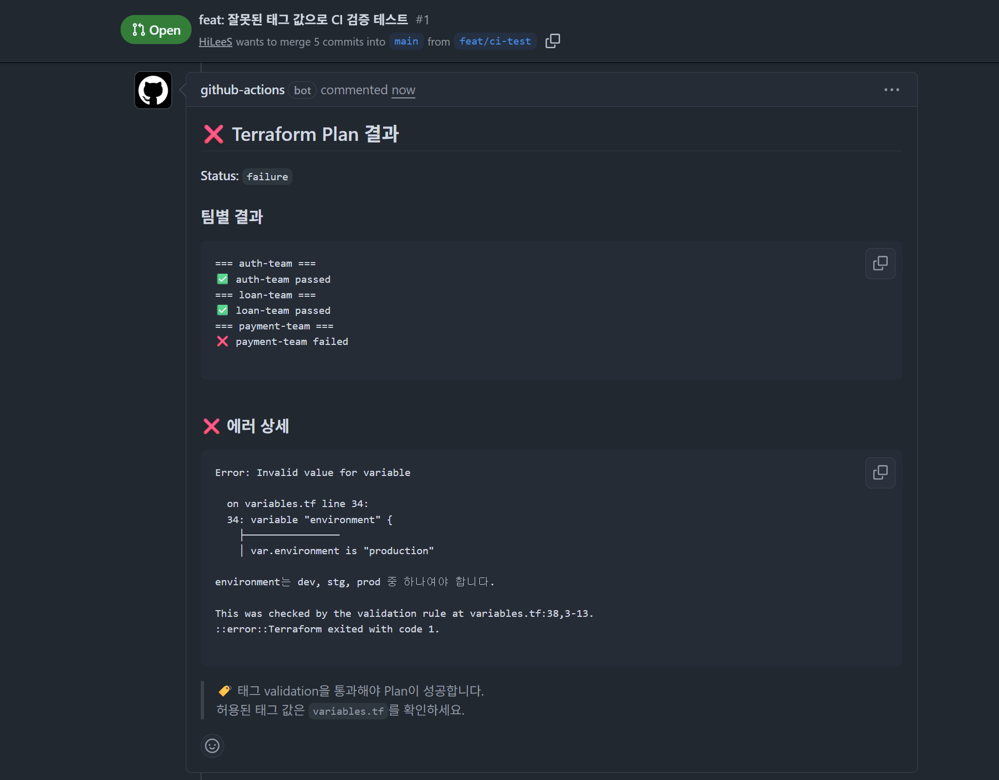
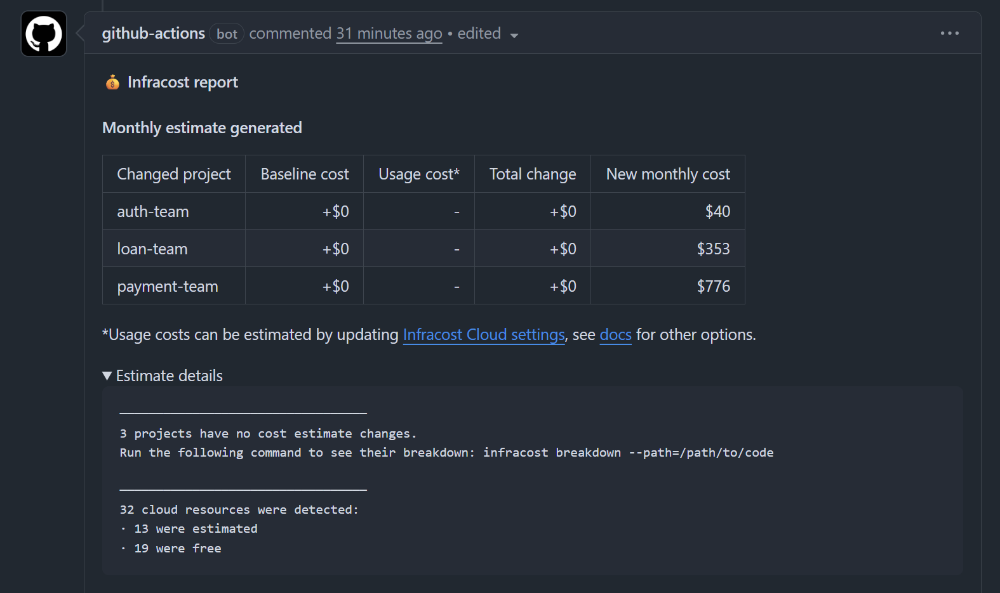
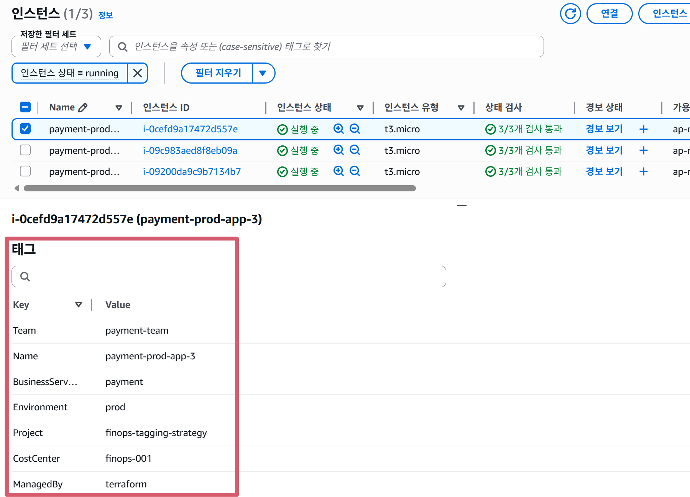
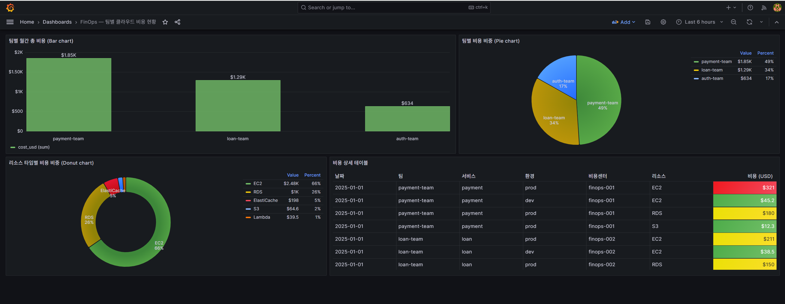

# FinOps: Terraform 기반 클라우드 리소스 태깅 전략과 비용 가시화

> "모든 리소스에는 주인이 있어야 한다"

## 📌 프로젝트 소개

여러 팀이 공유하는 AWS 환경에서 **비용 책임을 명확히** 하기 위한 태깅 전략을 Terraform으로 코드화하고, CI 파이프라인에서 태그를 강제하며, Grafana 대시보드로 비용을 시각화하는 End-to-End 프로젝트입니다.

### 시연 영상

- 🎬 [CI/CD 시연 영상](./docs/tech-semina-video.mp4)

## 🏢 가상 시나리오: FinTech Corp

| 팀 | 서비스 | 비용센터 | EC2 | RDS | NAT GW |
|-----|---------|----------|-----|-----|--------|
| payment-team | payment | finops-001 | m5.xlarge × 3 | db.r5.large | O |
| loan-team | loan | finops-002 | t3.large × 2 | db.t3.large | O |
| auth-team | membership | finops-003 | t3.medium × 1 | 없음 | X |

**환경:** dev / stg / prod

## 🏷️ 태그 표준

| 태그 키 | 설명 | 예시 |
|---------|------|------|
| `BusinessService` | 비즈니스 서비스명 | payment, loan, membership |
| `Team` | 담당 팀 | payment-team, loan-team, auth-team |
| `Environment` | 배포 환경 | dev, stg, prod |
| `CostCenter` | 비용 센터 코드 | finops-001, finops-002, finops-003 |
| `ManagedBy` | 관리 도구 (자동) | terraform |
| `Project` | 프로젝트명 (자동) | finops-tagging-strategy |

## 🏗️ 아키텍처

```
Terraform (태그 코드화)
    ↓
GitHub Actions (태그 검증 자동화)
    ↓
Infracost (PR 비용 추정)
    ↓
Grafana Dashboard (팀별 비용 시각화)
```

## 🛠️ 기술 스택

| 분류 | 기술 | 용도 |
|------|------|------|
| IaC | Terraform 1.7+ | HCL로 인프라 및 태그 정의 |
| CI | GitHub Actions | PR 기반 태그 검증 자동화 |
| 비용 추정 | Infracost | Terraform plan → 월간 비용 추정 |
| 시각화 | Grafana 10.2.3 | 팀별 비용 대시보드 |
| 데이터 서빙 | Nginx | CSV 파일 HTTP 서빙 |
| 데이터 소스 | Infinity Plugin | Grafana CSV 데이터 연결 |
| 컨테이너 | Docker Compose | Grafana + Nginx 로컬 실행 |
| 클라우드 | AWS (EC2, RDS, VPC, S3) | 리소스 생성 및 태그 확인 |

## 📁 프로젝트 구조

```
.
├── terraform/                    # Terraform 코드
│   ├── main.tf                   # 리소스 정의 (VPC, EC2, RDS, S3)
│   ├── variables.tf              # 변수 + validation 규칙
│   ├── providers.tf              # AWS 프로바이더 + default_tags
│   ├── outputs.tf                # 출력값 정의
│   ├── payment.tfvars            # payment-team 설정
│   ├── loan.tfvars               # loan-team 설정
│   └── auth.tfvars               # auth-team 설정
├── .github/workflows/            # CI 파이프라인
│   ├── terraform-ci.yml          # 태그 검증 + Plan
│   └── infracost.yml             # PR 비용 추정
├── grafana/                      # Grafana 대시보드
│   ├── docker-compose.yml        # Grafana + Nginx 컨테이너
│   ├── dashboards/
│   │   ├── dashboard.yml         # 대시보드 프로비저닝
│   │   └── finops-dashboard.json # 대시보드 JSON
│   ├── datasources/
│   │   └── csv.yml               # Infinity 데이터소스 설정
│   └── data/
│       └── cost_data.csv         # 비용 시뮬레이션 데이터
├── docs/                         # 발표 자료
│   └── tagging-standard.md       # 태깅 표준 문서
└── README.md
```

## 🚀 실행 방법

### 1. Terraform

```bash
cd terraform
terraform init
terraform plan -var-file="payment.tfvars"   # payment-team
terraform plan -var-file="loan.tfvars"       # loan-team
terraform plan -var-file="auth.tfvars"       # auth-team
terraform apply -var-file="payment.tfvars"   # 리소스 생성
terraform destroy -var-file="payment.tfvars" # 리소스 삭제
```

### 2. Grafana 대시보드

```bash
cd grafana
docker-compose up -d
# http://localhost:3000 접속 (admin / finops123)
```

## 📊 Infracost 팀별 비용 추정

| 팀 | 월간 비용 |
|----|----------|
| payment-team | $776 /mo |
| loan-team | $353 /mo |
| auth-team | $40 /mo |

## 📸 스크린샷

### CI — 태그 검증 실패 / 성공


### Infracost — PR 비용 코멘트


### AWS 콘솔 — 태그 적용 확인


### Grafana — 팀별 비용 대시보드


## 🔧 트러블슈팅

### 1. Grafana CSV local 모드 차단
- **문제:** Grafana 보안 정책으로 로컬 파일 읽기가 차단됨
- **해결:** Nginx 컨테이너를 추가하여 CSV를 HTTP로 서빙하는 구조로 변경

### 2. Grafana 플러그인 변경
- **문제:** marcusolsson-csv-datasource가 HTTP 모드에서 CSV 헤더 인식 문제 발생
- **해결:** yesoreyeram-infinity-datasource로 플러그인 변경, JSON 기반 쿼리로 전환

### 3. Infracost PR 코멘트 금액 미표시
- **문제:** 합산 JSON 1개만 전달하면 프로젝트 구분이 안 돼서 금액 테이블이 생략됨
- **해결:** 팀별 JSON 3개를 각각 `--path`로 전달 + `--show-all-projects` 옵션 추가

### 4. RDS 서브넷 단일 AZ 문제
- **문제:** public/private subnet이 같은 AZ(ap-northeast-2a)에 위치하여 RDS 생성 실패
- **해결:** private subnet을 다른 AZ(ap-northeast-2c)로 변경

### 5. Infracost GitHub App 충돌
- **문제:** Infracost 대시보드 앱과 yml이 동시에 PR 코멘트를 업데이트하면서 충돌
- **해결:** GitHub App에서 레포 접근 권한 제거

## 💡 배운 점

- **비용을 볼 수 있어야 비용을 줄일 수 있다** — 가시화가 최적화의 전제 조건
- **태그는 단순한 라벨이 아니라, 비용 관리의 시작점이다** — 태그만으로 팀별, 서비스별 비용 추적 가능
- **FinOps는 먼 얘기가 아니었다** — 팀이 늘어나고 리소스가 많아지면 반드시 필요한 관점

## 📎 참고

- [FinOps Foundation](https://www.finops.org/)
- [Terraform default_tags](https://registry.terraform.io/providers/hashicorp/aws/latest/docs#default_tags)
- [Infracost](https://www.infracost.io/)